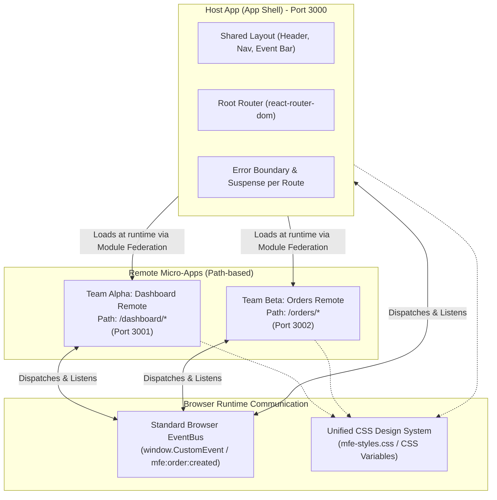

# Micro-Frontend Architecture & Implementation Reference Guide

This document outlines the architecture, directory structure, configuration, and patterns for building a React Micro-Frontend platform with Vite, Module Federation, a Shared Layout (Shell), path-based independent remote applications, and zero monorepo package overhead.

---

## 1. Architecture Overview

In this pattern, the **Host Application (App Shell)** is responsible for global layouts, top-level navigation, and route orchestration. **Remote Applications** are domain-driven micro-apps owned by independent teams, loaded dynamically into the Host's content area based on the URL path.



---

## 2. Workspace Project Structure

Using standard npm workspaces provides a lightweight monorepo setup where each micro-app is fully autonomous and can be run independently or aggregated together.

```text
micro-frontend-playground/
├── package.json               # Monorepo workspaces definition
├── tsconfig.json              # Shared TypeScript config
├── docs/
│   └── micro-frontend-architecture.md
└── apps/
    ├── host/                  # App Shell / Container App (Port 3000)
    │   ├── package.json
    │   ├── vite.config.ts
    │   ├── index.html
    │   └── src/
    │       ├── components/    # AppLayout, RemoteErrorBoundary
    │       ├── pages/         # HomePage, DocsPage
    │       ├── eventBus.ts    # Cross-app event subscriber/emitter
    │       ├── mfe-styles.css # Pure CSS design system
    │       ├── App.tsx        # Top-level routing
    │       └── main.tsx
    ├── remote-dashboard/      # Team Alpha Micro-App (Port 3001)
    │   ├── package.json
    │   ├── vite.config.ts
    │   ├── index.html          # Standalone dev runner entry
    │   └── src/
    │       ├── DashboardRoutes.tsx # Federated entry component
    │       ├── eventBus.ts
    │       ├── App.tsx         # Standalone app wrapper
    │       └── main.tsx
    └── remote-orders/         # Team Beta Micro-App (Port 3002)
        ├── package.json
        ├── vite.config.ts
        ├── index.html          # Standalone dev runner entry
        └── src/
            ├── OrdersRoutes.tsx # Federated entry with deep sub-routes
            ├── eventBus.ts
            ├── App.tsx         # Standalone app wrapper
            └── main.tsx
```

---

## 3. Core Architectural Responsibilities

### A. Host Application (Shell)
1. **Top-Level Navigation & Layout**: Provides the common Header, active route indicators, notifications dropdown, and live event ticker.
2. **Dynamic Federation Loading**: Uses `React.lazy()` and dynamic imports (`import('remoteDashboard/DashboardRoutes')`) to fetch remotes on demand over HTTP.
3. **Resilience & Fault Isolation**: Wraps every remote module inside a `<RemoteErrorBoundary>` and `<Suspense>`. If a remote fails or is unreachable, the rest of the application remains fully functional.
4. **MFE Boundary Inspector**: Allows toggling visual outline boundaries and ownership badges across remotes.

### B. Remote Applications (Domain Micro-Apps)
1. **Autonomous Sub-Routing**: Each remote exposes a top-level route component (e.g. `OrdersRoutes`, `DashboardRoutes`) managing its own internal sub-paths (`/`, `/create`, `/view/:orderId`).
2. **Dual-Mode Operation**:
   - **Integrated Mode**: Loaded dynamically by Host as a federated remote module.
   - **Standalone Mode**: Can be started and run independently on its own dev server (e.g. `localhost:3002`) for rapid team iteration without requiring the Host shell.

### C. Cross-MFE Communication (Event Bus)
1. **Decoupled Messaging**: Remotes emit and subscribe to typed events on `window` via `window.dispatchEvent(new CustomEvent('mfe:order:created', { detail }))`.
2. **Zero Direct Coupling**: No micro-app needs to import code or state directly from another micro-app.

---

## 4. Configuration Examples

### 1. Host `vite.config.ts`
```ts
import { defineConfig } from 'vite';
import react from '@vitejs/plugin-react';
import federation from '@originjs/vite-plugin-federation';

export default defineConfig({
  plugins: [
    react(),
    federation({
      name: 'host_app',
      remotes: {
        remoteDashboard: 'http://localhost:3001/assets/remoteEntry.js',
        remoteOrders: 'http://localhost:3002/assets/remoteEntry.js',
      },
      shared: ['react', 'react-dom', 'react-router-dom']
    })
  ],
  server: {
    port: 3000,
    strictPort: true,
    host: '0.0.0.0'
  },
  preview: {
    port: 3000,
    strictPort: true,
    host: '0.0.0.0'
  },
  build: {
    target: 'esnext',
    minify: false,
    cssCodeSplit: false
  }
});
```

### 2. Remote `vite.config.ts` (Orders Remote)
```ts
import { defineConfig } from 'vite';
import react from '@vitejs/plugin-react';
import federation from '@originjs/vite-plugin-federation';

export default defineConfig({
  plugins: [
    react(),
    federation({
      name: 'remote_orders',
      filename: 'remoteEntry.js',
      exposes: {
        './OrdersRoutes': './src/OrdersRoutes.tsx'
      },
      shared: ['react', 'react-dom', 'react-router-dom']
    })
  ],
  server: {
    port: 3002,
    strictPort: true,
    cors: true,
    host: '0.0.0.0'
  },
  preview: {
    port: 3002,
    strictPort: true,
    cors: true,
    host: '0.0.0.0'
  },
  build: {
    target: 'esnext',
    minify: false,
    cssCodeSplit: false
  }
});
```

---

## 5. Code Patterns

### 1. Host Layout and Dynamic Routing (`apps/host/src/App.tsx`)
```tsx
import React, { Suspense, lazy } from 'react';
import { BrowserRouter, Routes, Route, Link } from 'react-router-dom';
import { AppLayout } from './components/AppLayout';
import { RemoteErrorBoundary } from './components/RemoteErrorBoundary';
import { HomePage } from './pages/HomePage';
import { DocsPage } from './pages/DocsPage';

// Dynamically lazy-load remote micro-frontends
const DashboardRoutes = lazy(() => import('remoteDashboard/DashboardRoutes'));
const OrdersRoutes = lazy(() => import('remoteOrders/OrdersRoutes'));

export function App() {
  return (
    <BrowserRouter>
      <AppLayout>
        <Suspense
          fallback={
            <div className="mfe-card mfe-spinner-wrapper">
              <div className="mfe-spinner"></div>
              <span>Loading micro-frontend module...</span>
            </div>
          }
        >
          <Routes>
            <Route path="/" element={<HomePage />} />
            <Route path="/docs" element={<DocsPage />} />

            {/* Team Alpha: Dashboard */}
            <Route
              path="/dashboard/*"
              element={
                <RemoteErrorBoundary remoteName="Team Alpha: Dashboard Remote" expectedPort={3001} devCommand="npm run dev:dashboard">
                  <DashboardRoutes />
                </RemoteErrorBoundary>
              }
            />

            {/* Team Beta: Orders */}
            <Route
              path="/orders/*"
              element={
                <RemoteErrorBoundary remoteName="Team Beta: Orders Remote" expectedPort={3002} devCommand="npm run dev:orders">
                  <OrdersRoutes />
                </RemoteErrorBoundary>
              }
            />
          </Routes>
        </Suspense>
      </AppLayout>
    </BrowserRouter>
  );
}
```

### 2. Remote Sub-Router (`apps/remote-orders/src/OrdersRoutes.tsx`)
```tsx
import React, { useState } from 'react';
import { Routes, Route } from 'react-router-dom';
import { eventBus, OrderPayload } from './eventBus';

export default function OrdersRoutes() {
  const [orders, setOrders] = useState<OrderPayload[]>(INITIAL_ORDERS);

  const handleAddOrder = (newOrder: OrderPayload) => {
    setOrders((prev) => [newOrder, ...prev]);
    eventBus.emitOrder(newOrder); // Dispatches cross-MFE event
  };

  return (
    <div className="mfe-boundary mfe-boundary-orders">
      <Routes>
        <Route index element={<OrdersList orders={orders} />} />
        <Route path="create" element={<CreateOrder onAddOrder={handleAddOrder} />} />
        <Route path="view/:orderId" element={<OrderDetails orders={orders} />} />
      </Routes>
    </div>
  );
}
```

### 3. Cross-MFE Event Bus (`eventBus.ts`)
```ts
export interface OrderPayload {
  orderId: string;
  customer: string;
  items: string;
  amount: number;
  status: 'processing' | 'shipped' | 'delivered';
  timestamp: number;
}

export const eventBus = {
  emitOrder(payload: OrderPayload) {
    if (typeof window !== 'undefined') {
      window.dispatchEvent(new CustomEvent('mfe:order:created', { detail: payload }));
    }
  },
  onOrder(handler: (payload: OrderPayload) => void) {
    if (typeof window === 'undefined') return () => {};
    const listener = (e: Event) => handler((e as CustomEvent<OrderPayload>).detail);
    window.addEventListener('mfe:order:created', listener);
    return () => window.removeEventListener('mfe:order:created', listener);
  }
};
```

### 4. Resilient Error Boundary (`apps/host/src/components/RemoteErrorBoundary.tsx`)
```tsx
import React, { Component, ReactNode, ErrorInfo } from 'react';

interface Props {
  remoteName: string;
  expectedPort: number;
  devCommand: string;
  children: ReactNode;
}

interface State {
  hasError: boolean;
  error?: Error;
}

export class RemoteErrorBoundary extends Component<Props, State> {
  state: State = { hasError: false };

  static getDerivedStateFromError(error: Error): State {
    return { hasError: true, error };
  }

  componentDidCatch(error: Error, info: ErrorInfo) {
    console.error(`[MFE Boundary] Remote "${this.props.remoteName}" crashed:`, error, info);
  }

  handleRetry = () => {
    this.setState({ hasError: false, error: undefined });
  };

  render() {
    if (this.state.hasError) {
      return (
        <div className="mfe-card" style={{ border: '1px solid rgba(239, 68, 68, 0.4)' }}>
          <h3>⚠️ {this.props.remoteName} Outage (Port {this.props.expectedPort})</h3>
          <p>{this.state.error?.message || 'Remote module failed to load.'}</p>
          <button className="mfe-btn mfe-btn-danger" onClick={this.handleRetry}>
            🔄 Retry Remote
          </button>
        </div>
      );
    }
    return this.props.children;
  }
}
```

---

## 6. Inter-App Communication Strategies

| Pattern | How It Works | Best Used For |
| :--- | :--- | :--- |
| **URL Parameters & Paths** | Route params (`/orders/view/:id`), Query string (`?tab=history`) | Deep-linking, shareable links, navigation |
| **Browser Event Bus (CustomEvent)** | `window.dispatchEvent(new CustomEvent('mfe:order:created', { detail }))` | Real-time decoupled notifications & reactive metrics |
| **Local / Session Storage** | `localStorage` with storage event listener | Cross-tab persistence and session synchronisation |

---

## 7. Best Practices & Key Takeaways

1. **Singleton Dependencies**: Always declare `react`, `react-dom`, and `react-router-dom` in `shared` in each app's module federation config.
2. **Pure CSS & CSS Variables**: Share design tokens via CSS variables rather than heavyweight component libraries, preserving team autonomy and fast build times.
3. **Internal Sub-Routing with Relative Paths**: Use relative route links (`navigate('create')`, `navigate('..')`) inside remotes so they function properly whether mounted at `/orders/*` in the Host Shell or `/*` in Standalone mode.
4. **Fault Isolation by Default**: Always wrap remote federated components in an ErrorBoundary to prevent cascading failures across micro-apps.
